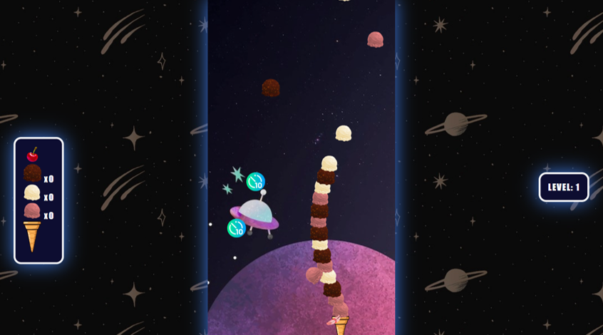

# GALACTIC ICECREAMS

Be the best ice cream maker in the universe ! Galactic Icecream is a fun and addictive browser game where the player needs to fulfill icecream orders for alien customers.

## How to play

The player controls the ice cream cone and moves it left and right to catch the corresponding ice cream balls. 
The ice cream needs to be finished with a cherry! Be careful, if you catch a cherry without completing the order (displayed on the left of the game board), you will fail the level!

    - Left Arrow Key = Move Left
    - Right Arrow Key = Move Right

## Special Items

On top of ice cream balls, the player has the chance to catch two kinds of special objects that with special effets 

### Anti Gravity Feather

 

After getting ice creams scoops, the player will get   heavier and its speed will decrease. By catching an anti gravity feather, you will feel as light as a feather for 10 seconds and get maximum speed!  

### Slow Time

By catching this item, you will slow the time for 10 seconds, causing the objects falling to fall slower for 10 seconds. 

## Demo Link

Click here to access the game demo: [Galactic Ice Cream](https://3drine.github.io/oop-game-galactic-icecream/)